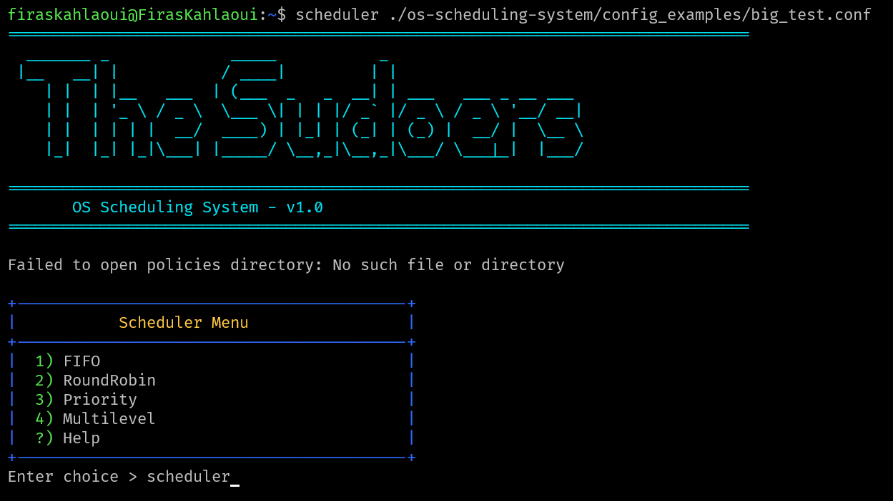
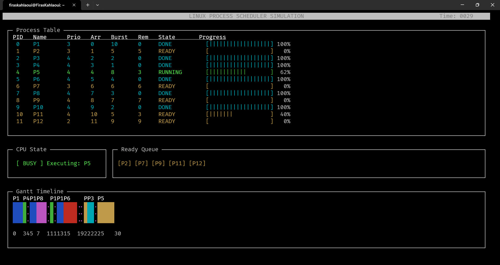

# 🐧 Linux Process Scheduler Simulator


A robust, interactive C-based simulator for operating system process scheduling policies. Developed for the Advanced Operating Systems course at **ISI**.

This project implements core scheduling algorithms including **FIFO**, **Round-Robin**, **Priority**, and **Multilevel Queues**, featuring a rich **ncurses-based graphical interface** for real-time visualization.

---

## ✨ Key Features

* **Multiple Scheduling Policies**:
  * First-In-First-Out (FIFO)
  * Round-Robin (RR) with configurable quantum
  * Preemptive Static Priority
  * Multilevel Queue with Aging (Skeleton)
* **Interactive Dashboard**: Real-time visualization of the CPU, Ready Queue, and Process Table using `ncurses`.
* **Dynamic Configuration**: Load processes from config files or generate them randomly.
* **Smart Installation**: Automated `Makefile` that handles system-wide or local user installation.
* **Detailed Logging**: Comprehensive execution metrics.

---

## 📸 Screenshots

### Application Launch



### Real-time Graphical Dashboard



---

## 🚀 Installation

### Prerequisites

* **GCC** Compiler
* **Make**
* **libncurses-dev** (Required for the GUI)

```bash
sudo apt-get update
sudo apt-get install build-essential libncurses5-dev libncursesw5-dev
```

### Build & Install

1. **Clone the repository:**

    ```bash
    git clone https://github.com/FirasKahlaoui/os-scheduling-system
    cd os-scheduling-system
    ```

2. **Compile:**

    ```bash
    make
    ```

3. **Install:**
    The installation script automatically detects your permissions.
    * **Root/Sudo**: Installs to `/usr/local/bin` (System-wide).
    * **User**: Installs to `~/.local/bin` (Local).

    ```bash
    make install
    ```

    *Note: If installed locally, ensure `~/.local/bin` is in your `$PATH`.*

---

## 📖 Usage

### Interactive Mode

Run the scheduler without arguments to enter the interactive menu:

```bash
scheduler
```

### Command Line Mode

Run with a specific configuration file and policy:

```bash
scheduler config_examples/test1.conf FIFO
scheduler config_examples/test2.conf RoundRobin 4
```

### Help System

Access built-in documentation:

```bash
scheduler --help
# OR inside the app:
help fifo
```

---

## ⚙️ Configuration File Format

Create your own process scenarios using the following format:

```text
# Name    Arrival    Burst    Priority
P1        0          10       1
P2        2          5        2
```

---

## 📂 Project Structure

```
.
├── bin/              # Compiled executables
├── config_examples/  # Sample process scenarios
├── doc/              # Documentation (User Guide, Technical Report)
├── obj/              # Object files
├── policies/         # Scheduling algorithm implementations
├── src/              # Core source code (main, parser, display)
├── Makefile          # Build automation
└── README.md         # This file
```

---

## 🧑‍💻 The Team (The Sudoers Group - 1ING3)

| Member | Role |
| :--- | :--- |
| **Firas Kahlaoui** | Scrum Master |
| **Oussema Abdelmoumen** | Developer |
| **Hamza Bargoug** | Developer |
| **Seifeddine Ben Fredj** | Developer |
| **Malek Nasri** | Developer |

---

## 📄 License

This project is licensed under the **MIT License**. See the `LICENSE` file for details.

**Justification:** The license choice was validated by scanning the codebase with `scancode-toolkit`, ensuring no conflicting proprietary code exists. The detailed scan results can be found in `scan_results.json`.
